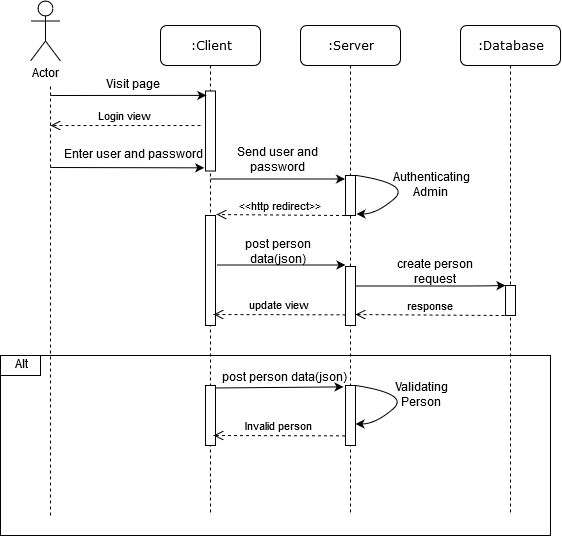

# Backend megvalósítása
## Fejlesztői környezet és annak beállításai
- Fejlesztéshez szükséges programok:
	- Java 1.8
	- Netbeans (vagy bármilyen más java kódot fordítani és futtatni képes eszköz) 
	- Postgres (vagy más endpoint tesztre képes eszköz)
- Program futtatásához szükséges külön beállítások:
	- Nincs ilyen
## Adatbázis terv:

- Ahol az Enum értékei: TELEPHONE, MOBILE_PHONE, EMAIL
## Könyvtárstruktúra
A programban 6 külön alkönyvtár található, amik a következőek:
- **Entities**: Ez a mappa tárolja az adatbázisbeli táblák Java beli ábrázolását.
- **Repositories**: Az adott entiti-kből való adatlekéréseket tároló osztályok találhatóak meg ebben a mappában.
- **Controllers**: A különböző entitik megnézéséhez/felvételéhez/szerkesztéséhez/törléséhez szükséges endpointokat tartalmazó mappa.
- **Security**: Az adatbázis endpoint védelmét szolgáló osztályait tároló mappa.
- **Keys**: A Contact osztály összetett kulcsát representáló segédosztályt tároló mappa.
- **Error**: Speciális errorüzeneteket osztályát tároló mappa.
## Végpontok
###### Person végpontjai
- GET
	- Link: `/person`
		- Funkciója: Visszaadja az összes Person-t
		- Bemenet: nincs
		- Kimenet: az összes Person json-ben
		- Hozzáférési szint: mindenki
	- Link: `/person/findByName`
		- Funkciója: A bemeneti érték szerint megkeresi az adott személyek elérhetőségeit (a név egy részlete is elég).
		- Bemenet: json `name` paraméterrel
		- Kimenet: json-ben Person-ök a Contact-jaikkal
		- Hozzáférési szint: mindenki
- POST
	- Link: `/person/new`
		- Funkciója: Új persont fesz fel
		- Bemenet: json-ben a person adatai
		- Kimenet: A felvett person JSON-ben
		- Hozzáférési szint: admin
	- Link: `/person/{id}/{departmentId}`
		- Funkciója: Az id-ben lévő persont felveszi a departmentIdben lévő Departmentbe
		- Bemenet: a linkben lévő id és departmentId
		- Kimenet: A person JSON-ben
		- Hozzáférési szint: admin
- PUT
	- Link: `/person/:id`
		- Funkciója: id alapján azonosít majd módosítja a person-található
		- Bemenet: json-ben a person adatai és a linkben található id érték
		- Kimenet: A módosított person adatai
		- Hozzáférési szint: admin
- DELETE
	- Link `/person/{id}`
		- Funkciója: A linkben megadott id-jű személy törlése
		- Bemenet: a linkben található id érték
		- Kimenet: sikeres hívás esetén semmi
		- Hozzáférési szint: admin
	
###### Department végpontjai
- GET
	- Link: `/department`
		- Funkciója: Visszaadja az összes Department-et a benne lévő emberekkel és elérhetőségeikkel.
		- Bemenet: nincs
		- Kimenet: json-ben az összes Department a benne lévő Person-ökkel és a Contact-jaikkal
		- Hozzáférési szint: mindenki
	- Link: `/department/findByName`
		- Funkciója: A bemeneti érték szerint megkeresi a Department-et és visszaadja a benne dolgozó emberek elérhetőségeit.
		- Bemenet: json `name` paraméterrel
		- Kimenet: json-ben 1 Department a benne lévő Person-ökkel és a Contact-jaikkal
		- Hozzáférési szint: mindenki
- POST
	- Link: `department/new` 
		- Funkciója: Új department vehetünk fel
		- Bemenet: json a deparment adatai (ott dolgozó emberek)
		- Kimenet: A létrejött department
		- Hozzáférési szint: admin
	- Link: `/person/{id}/{personId}`
		- Funkciója: Az id-ben lévő departmentet felveszi a personIdben lévő Personhőz
		- Bemenet: a linkben lévő id és personId
		- Kimenet: A department JSON-ben
		- Hozzáférési szint: admin
- PUT
	- Link: `department/{id}` 
		- Funkciója: Megkeresi a linkben megadott department id alapján majd módosítja a json-ben kapott értékekre.
		- Bemenet: A linkben található id érték és a department értékei json-ben
		- Kimenet: A módosított deparment
		- Hozzáférési szint: admin
- DELETE
	- Link `/department/{id}`
		- Funkciója: A linkben megadott id-jű Department törlése
		- Bemenet: a linkben található id érték
		- Kimenet: sikeres hívás esetén semmi
		- Hozzáférési szint: admin
###### Contact végpontjai
- GET
	- Link: `/contact`
		- Funkciója: Visszaadja az összes Contact-ot.
		- Bemenet: nincs
		- Kimenet: json-ben az összes Contact
		- Hozzáférési szint: mindenki
	- Link: `/contact/findByName`
		- Funkciója: A bemeneti érték szerint megkeresi azt a Person-t akihez a contact-ban szereplő érték vagy annak egy részlete tartozik
		- Bemenet: json `contact` paraméterrel
		- Kimenet: json-ben 1 bahy több Person a benne lévő Contact-jaikkal
		- Hozzáférési szint: mindenki
- POST
	- Link: `/contact/new`
		- Funkciója: Új contact felvételét végzi el.
		- Bemenet: Egy contact json-ban
		- Kimenet: Az új contact
		- Hozzáférési szint: admin
- DELETE
	- Link `/contact/{contact}`
		- Funkciója: A linkben megadott contact-ú Contact törlése
		- Bemenet: a linkben található contact érték
		- Kimenet: sikeres hívás esetén semmi
		- Hozzáférési szint: admin
###### Admin végpontjai
- GET
	- Link: `/admins`
		- Funkciója: Visszaadja az összes Admin-t.
		- Bemenet: nincs
		- Kimenet: json-ben az összes Admin
		- Hozzáférési szint: admin
- POST
	- Link: `/admins/new`
		- Funkciója:  Új admint vehetünk fel.
		- Bemenet: Az admin adati
		- Kimenet: Az új admin adati
		- Hozzáférési szint: admin
- PUT
	- Link: `/admins/:id`
		- Funkciója: Meglévő admin módosítása id szerint
		- Bemenet: A paraméterben lévő id és az admin adatai
		- Kimenet: A módosított admin
		- Hozzáférési szint: admin
- DELETE
	- Link `/admin/{id}`
		- Funkciója: A linkben megadott id-ű Admin törlése
		- Bemenet: a linkben található id érték
		- Kimenet: sikeres hívás esetén semmi
		- Hozzáférési szint: admin
		
## Szekvencia diagram post people-ra

[Vissza az főleírásra](../README.md)
