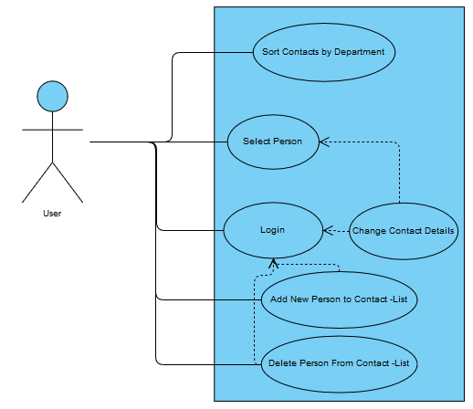

# Dokumentáció - Működő prototípus
## Use-case diagram

## Fejlesztői környezet
Az Angular project lokálisan fut a backend melett. Az alkalmazás visual studio fejlesztői környezet segítségével készült.

A fő komponens a person-list itt jelenítjük meg az alkalmazottak elérhetőségit. Contact-detail komponens jeleníti meg egy ember összes elérhetőségét. Department-filterrel kiszűrhetjük az adatokat osztály szerint.

# Dokumentáció - Kész alkalmazás
Az alkalmazás megnyitásával betöltődnek az adatok a Backendről. 
